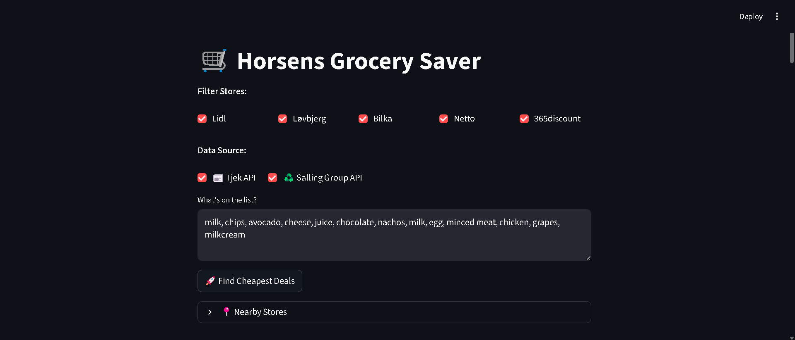
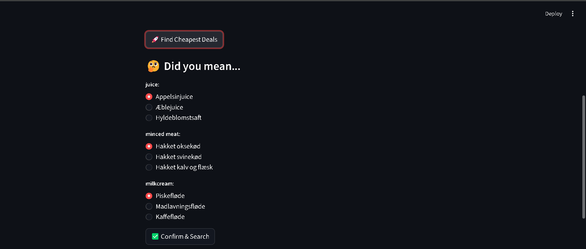
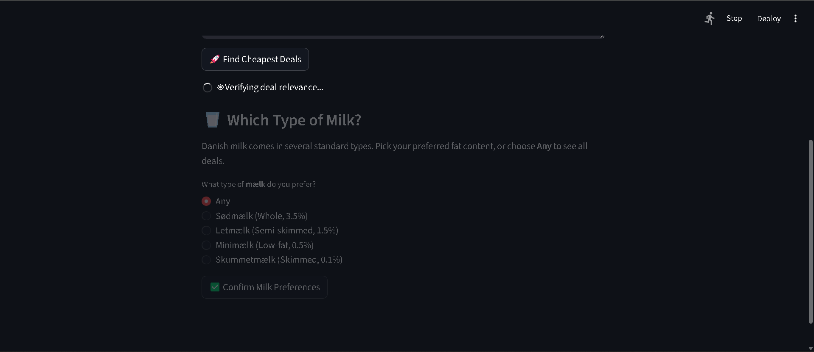
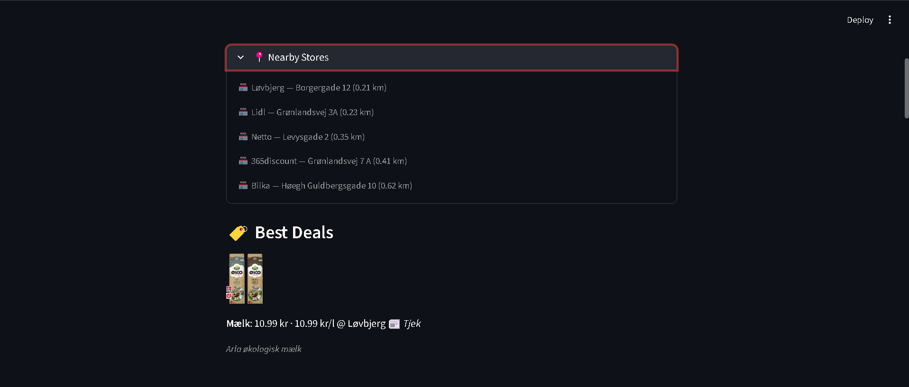
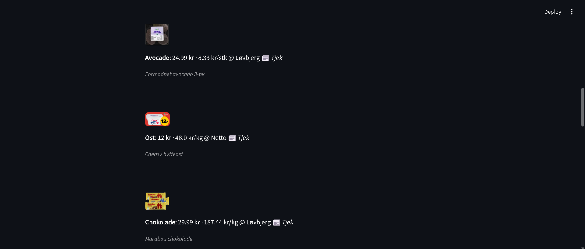

# 🛒 Horsens Grocery Saver

A Streamlit web application that finds the **cheapest grocery deals** near Horsens, Denmark.  
Paste your shopping list in natural language, and the app uses **Gemini AI** to extract items, then queries the **Tjek (etilbudsavis) API** to surface the best current and upcoming offers within 2.5 km.

---

## Screenshots









---

## Architecture

The project follows a **clean, modular architecture** with clear separation of concerns:

```
GroceriesSaver/
│
├── app.py                  # Streamlit entry point
│
├── config/
│   └── settings.py         # Environment variables, API keys, constants
│
├── services/
│   ├── ai_service.py       # Gemini AI: item extraction & offer matching
│   ├── store_service.py    # Tjek API: nearby store lookup
│   └── offer_service.py    # Tjek API: offer search, filtering & ranking
│
├── utils/
│   ├── geo.py              # Haversine distance calculation
│   ├── pricing.py          # Unit price computation
│   └── time_utils.py       # Timestamp parsing helpers
│
├── ui/
│   ├── components.py       # Reusable Streamlit widgets
│   └── pages.py            # Phase-based page logic
│
├── models/
│   └── schemas.py          # Data classes (Store, ItemResult, …)
│
├── requirements.txt
├── .env.example
└── README.md
```

| Layer | Responsibility |
|-------|---------------|
| **config** | Centralised settings and API configuration |
| **services** | Business logic – AI calls, store lookup, offer ranking |
| **utils** | Pure helper functions with no side effects |
| **ui** | All Streamlit rendering and user interaction |
| **models** | Typed data containers shared across layers |

---

## Technologies

- **Python 3.11+**
- **Streamlit** — interactive web UI
- **Google Gemini AI** (`google-generativeai`) — natural-language item extraction
- **Tjek / etilbudsavis API** — real-time Danish grocery offers
- **Salling Group API** — food waste offers
- **Requests** — HTTP client
- **python-dotenv** — environment variable management

---

## How to Run Locally

### 1. Clone the repository

```bash
git clone https://github.com/<your-username>/GroceriesSaver.git
cd GroceriesSaver
```

### 2. Create a virtual environment (recommended)

```bash
python -m venv .venv
# Windows
.venv\Scripts\activate
# macOS / Linux
source .venv/bin/activate
```

### 3. Install dependencies

```bash
pip install -r requirements.txt
```

### 4. Configure environment variables

```bash
cp .env.example .env
# Edit .env and add your API keys
```

### 5. Run the app

```bash
streamlit run app.py
```

The app will open at **http://localhost:8501**.

---

## Environment Variables

| Variable | Description |
|----------|-------------|
| `GEMINI_API_KEY` | Google Gemini API key ([get one here](https://aistudio.google.com/app/apikey)) |
| `TJEK_API_KEY` | Tjek / etilbudsavis API key |

---

## How the Discount Search Works

1. **Item extraction** — The user types a free-text shopping list (Danish). Gemini AI parses it into individual grocery items, flagging ambiguous terms for clarification.

2. **Store discovery** — The app queries the Tjek API for stores within a **2.5 km radius** of the configured location (Horsens) and filters to the user's selected chains (Lidl, Netto, Bilka, Løvbjerg, 365discount).

3. **Offer search** — For each item the app searches offers across the nearby stores. Results are filtered for relevance using keyword matching with an AI fallback for tricky names.

4. **Best deal selection** — Offers are split into *current* (active now) and *future* (starting later). The cheapest offer is selected using **unit price** (kr/kg, kr/l) when available, falling back to shelf price.

5. **Upcoming Discounts** — After displaying the best current deals, a dedicated section shows future offers that are **cheaper** than today's best. This helps the user decide whether to buy now or wait.

---

## License

MIT
